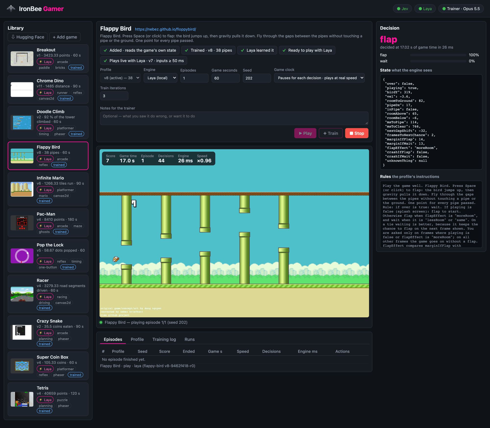
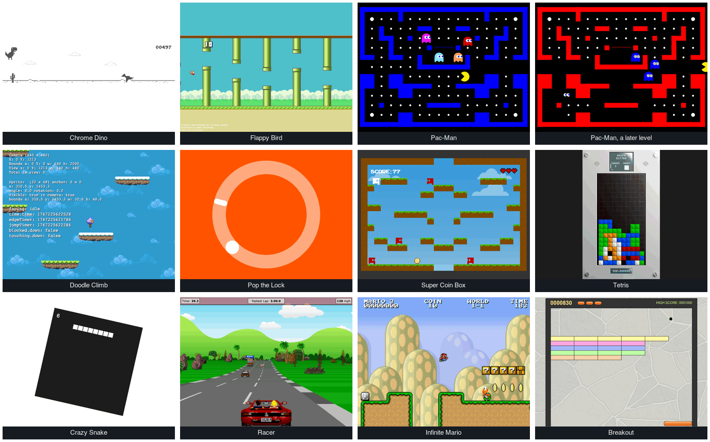

<p align="center">
  
</p>

<h1 align="center">IronBee Gamer</h1>

<p align="center">
  <strong>Plays browser games live with a fast decision engine. An LLM trains each game's profile from the games it plays.</strong>
</p>

---

IronBee Gamer opens a browser game, reads what the page draws into a small JSON state, and asks a
decision engine to pick every move. It works without any help from the game: it needs no API and
no hooks the game exposes.

You can watch the game being played in a local web UI. Each decision is shown beside it: the
state the engine saw, the action it chose and the probabilities.



*Laya playing Flappy Bird in the UI: 17 s into the game, 44 decisions so far at 26 ms each. On the right, the decision
just made (`flap`), the state it was made on, and the rules the trainer wrote.*

```
page (canvas / engine)
  └─ perception adapter ── generic, per rendering tech (2D canvas draw recorder, Phaser / PixiJS / Cocos dump,
                           any canvas as a small colour grid), or a reader of the game's own state the
                           trainer wrote from the page's code
  └─ extract(raw, memory) ── per game, written by the trainer (an LLM), < 1 ms
  └─ state JSON (features, never the answer)
  └─ decision engine ── Jev (hosted) or Laya (local, fine-tuned per game)
  └─ keys held / the pointer held / a click
  └─ the game's clock runs one tick ← the game moves only between decisions
```

**The division of labor.** Each part has one job:

- **The trainer (an LLM through a coding-agent CLI: the Claude Code CLI or the Codex CLI, chosen with the UI's Trainer pill)** writes the logic: what the state
  computes, such as distances, how soon things happen and what is possible now. It also writes the rules that
  map those features to an action.
- **The decision engine** makes every live decision by applying those rules to the state.

A state that carries the answer (`advice: "JUMP"`) would make the engine a rubber stamp. Such
fields are stripped before the engine sees the state, and the trainer is told how many were
removed.

## Quick start

```bash
npm install
npm run build
npm link                             # once: puts the `ibgamer` command on your PATH
ibgamer laya setup                   # once: a Python environment for Laya, the local engine (needs python3)
npm run ui                           # the web UI at http://127.0.0.1:1986 (the same as `ibgamer ui`)
```

Without `npm link`, `npm start -- <command>` runs the same commands (`npm start -- play dino --seconds 30`).

In the UI, **⇩ Hugging Face** downloads the trained games — each with its profile versions and Laya's model
(about 700 MB a game). Then pick a game and press **Play**. The browser is headless by default, and the
live view shows it. Use `--headed` to see the real window. Until the game's first frame (a Laya
server to start, the browser, the page to load: several seconds) the screen says which step it is on
and for how long, and why, if the game does not start. When a game ends, the screen says how: **Time's up**
(its Game seconds are played — nothing hangs), **Game over**, or **Stopped**.

What each part needs:

- **Playing with Laya** (the default): the Python environment above, and the game's model — downloaded, or trained here.
- **Playing with Jev**: its key, `export TYPESAFE_API_KEY=…` (or in a `.env` in the working directory).
- **Training, and adding a game**: a coding-agent CLI, installed and logged in — the Claude Code CLI (`claude`) or the
  Codex CLI (`codex`). The **Trainer** pill at the top of the UI says which one and which model is used, and chooses it.

```bash
ibgamer library list                 # the games and their active profiles
ibgamer play dino --seconds 30       # plays in the terminal; --watch paces it to the game's own speed
ibgamer train flappy-bird           # checks how it plays, fixes what loses (else trains for a higher score), keeps it only if it plays better
ibgamer check pacman-ghosts          # plays a seed twice: the same frame for frame, or where it first differs
ibgamer play pop-the-lock --lag 45   # real time simulated on the paused clock: each decision lands 45 ms late, every run the same
ibgamer play dino --tick 48          # tried with 48 ms of game time between two decisions instead of the version's tick
```

## The library

The library lists every game the app knows how to reach, start and measure, together with the
profiles that play it.



*The eleven built-in games, each part way through a game Laya is playing (Pac-Man twice: its first level, and a later
one with the ghosts on the run).*

| Game | Perception | Its rules as code, the training seeds | Seeds it was never trained on | Random play | Laya, distilled |
|---|---|---|---|---|---|
| Chrome Dino ([wayou/t-rex-runner](https://wayou.github.io/t-rex-runner/)) | 2D canvas | 1485 ×3 in 90 s games (v11, trained for real time too; night mode reached in all three) | 1485 ×3 | 51 | 1485 ×3, the same as its rules |
| Flappy Bird ([floppybird](https://nebez.github.io/floppybird/) by nebez, Apache-2.0) | the game's own state (HTML; its CSS animations run on game time) | 38 ×3 pipes in 60 s (v6, trained for real time too) | 38 ×3 | 3 | 38 ×3, the same as its rules |
| Pac-Man ([Pacman Canvas](https://pacman.platzh1rsch.ch/) by platzh1rsch, CC0) | pixels (a 90-wide colour grid) | 8410 ×3 in 180 s games, never died (v4, trained for real time too) | 8410 ×3 | 940 | 7680 ×3 |
| Doodle Climb ([Phaser examples](https://noowxela.github.io/phaser-examples/games/ready/doodle-jump/)) | Phaser | 84 %, 100 % of the tower in 60 s | 100 %, 78 %, 100 % | 16 % | 100 %, 100 % |
| Pop the Lock ([Phaser examples](https://noowxela.github.io/phaser-examples/games/ready/pop-the-lock/)) | Phaser (rotation) | 63, 59, 54 pops in 60 s | 19, 64, 60 | 6 | 63, 59, 54, the same as its rules |
| Super Coin Box ([Phaser examples](https://noowxela.github.io/phaser-examples/games/ready/super-coin-box/)) | Phaser (tilemap) | 109, 113, 94 coins in 60 s (v4, trained for real time too; v5, kept for real time only, plays it live) | 70, 128, 100 | 4 | 152, 115, 115 |
| Tetris ([Phaser examples](https://noowxela.github.io/phaser-examples/games/ready/jtetris/)) | Phaser (the game's own state) | 31192, 50126 points in 120 s (v4; the game's own score: four rows cleared at once 1200, one row 40, times the level + 1), never topped out | 46674, 31368, 50685 | 218 | 31192, 50126, the same as its rules |
| Crazy Snake ([Phaser examples](https://noowxela.github.io/phaser-examples/games/ready/crazy-snake/)) | Phaser (the game's own state) | 36, 35 coins in 90 s (v2, trained for real time too) | 34, 41, 34 | 0 | 39, 35 |
| Racer ([Javascript Racer](https://jakesgordon.com/games/racer/) by Jake Gordon, MIT) | the game's own state (a page reader) | 3383, 3263, 3192 road segments in 60 s (v4, trained for real time too) | 3436, 3432, 3401 | 61 | 3383, 3263, 3192, the same as its rules |
| Infinite Mario ([mariohtml5](https://kenspiretech.github.io/mariohtml5/main.html) by Robert Kleffner, Unlicense) | the game's own state (a page reader) | 1267, 1264, 1268: each level won (tiles run, +1000 for winning the level; v6, trained for real time too; Jev plays v7) | 1270, 1272, 1262, each won | 22 | 1267, 1264, 1268, the same as its rules |
| Breakout ([Javascript Breakout](https://jakesgordon.com/games/breakout) by Jake Gordon, MIT) | the game's own state (a page reader) | 3550, 3265, 3455 points in 60 s, each played to the end of its time (v1) | 3740, 4130, 3375 | 360 | 3550, 3265, 3455, the same as its rules |

Measured on 2026-09-29, the clock paused (`ibgamer measure`, `ibgamer laya eval`): the training seeds
are the ones versions are compared on, the others (1001, 2002, 3003) are never shown to the tuner,
and random play (a seeded random action a decision) is the floor. The seed generator changed that day
(splitmix32 → mulberry32; before it, 101, 202 and 303 began as nearly the same game), so these differ
from earlier records. Laya plays as well as its rules nearly everywhere and better in three games (Super Coin
Box 122 % of the way from random play to them, Doodle Climb 110 %, Crazy Snake 104 %); Pac-Man's v4 Laya is
90 % of the way to rules that now score 8410 (its v2 Laya was 107 % of v2's 5870). The Phaser Flappy
Bird and its pixel copy were retired for floppybird on the same day. Every number was measured twice under
heavy load (several games at once, up to 27 browsers): all the same but two seeds, one in Super Coin
Box (157 for 87) and one in Flappy Bird (17 for 38); replayed again, in parallel under load, those
give the numbers above every time. On 2026-09-30 every game was measured again, after changes to how a
page's clock starts (the clock installed before the page's own scripts; a loader's chained files, and
the sound and images a page decodes, settled before the first frame; session storage emptied for each
game): the same numbers, rules and Laya. Chrome Dino's v10, Racer
and Infinite Mario were trained that night and are measured with those changes; Pac-Man's v4 and Crazy
Snake's v2 were trained for real time on 2026-09-30 (Crazy Snake's with the UI's **For real time**) and
measured on 2026-10-01. Tetris is measured in the game's own points since 2026-10-01 (rows cleared in 120 s
rewarded keeping a column empty so that pieces fall less far, and never clearing four rows at once). That
day Tetris's v4 was trained in points (the trainer told, in its notes, about the column kept empty), Chrome
Dino's v11, Flappy Bird's v6, Super Coin Box's v5 and Infinite Mario's v5 and v6 for real time with each seed
played at 45, 53 and 60 ms, and Infinite Mario's v7 with Jev deciding.

Doodle Climb, Pop the Lock, Super Coin Box, Tetris, Crazy Snake, Pac-Man, Flappy Bird,
Racer and Infinite Mario were added and trained by this app itself: the trainer set them up from a sample of what the page shows, then tuned them.
Their game definitions are the only hand-written part. Breakout was added on 2026-10-06 wholly through the UI — **+ Add
game**, the trainer reading the game's code for its state, its score and its start — and trained once: its first
version was kept (a candidate that scored 4203 on the training seeds played the unseen ones worse, 3595 against
3748, and was turned away), and Laya learnt it — 2550, 3195, 2900 at first; **Train**, pressed once more for Laya, found
it below its rules on all three seeds and taught it more (two rounds of its own games, the rules correcting 331 and
234 of 10,000 decisions): 3550, 3265, 3455, the same as its rules.

The library has two roots that act as one:

- **Built-in** (`library/`, shipped with the package): the researched games, with their whole
  training history (every version, the tuner's analysis, the regression tests and the windows the
  tests replay).
- **Yours** (`~/.ibgamer/library`, or `IBGAMER_LIBRARY_DIR`): games you add, and every version
  training makes. A trained built-in game gets its new versions here, beside the shipped ones.
  You can always make an older version active again.

```
<game>/game.json            how to reach, start and measure it — never how to play it
<game>/profiles/v<N>.json   how to play it: extractor, rules, actions, timing, regression tests, results
<game>/windows/<id>.json    raw frames before a failure, replayed offline by the regression tests
<game>/samples/…            what training looked at (a raw sample, sprite crops, a screenshot)
<game>/decisions/*.jsonl    the engine's decisions while playing: distillation data for Laya
<game>/laya/<name>/         a Laya checkpoint fine-tuned on this game (v<profile>-<hash>-r<round>, ~650 MB)
```

To share a game, use `ibgamer library export <game> <dir>`, which writes every version into one
directory. Use `ibgamer library import <dir>` to add one. A game's extractor is JavaScript. It
runs in its own V8 context with no Node globals, no `eval`, a time limit, and only JSON crossing
the boundary. Still, add only games you trust.

### The Hugging Face library

Trained games are shared on Hugging Face, in one model repo with a folder a game
([ironbee-ai/ironbee-gamer-library](https://huggingface.co/ironbee-ai/ironbee-gamer-library) by default,
`IBGAMER_HF_REPO` to use another): each game's definition, its profile versions, its windows and samples, and
Laya's checkpoints of the versions it plays — not every round of every version, not the decision logs. A game
pulled from it plays at once, trained: Laya with no distillation, Jev with your own key.

- In the UI, **⇩ Hugging Face** above the library lists the shared games — how Laya and Jev play each, its size,
  and what your library has of it — and downloads one (**Download**, **Update**). A game trained in your library
  is replaced only after a second click; its decision logs stay.
- `ibgamer library hf` lists them; `ibgamer library pull <game…>` downloads (`--replace` over your own training).
  Every file is checked against its sha256 in the repo's `index.json`, all of a pull read at one commit.
- `ibgamer library push [game…]` shares games (every one by default) with the Hugging Face CLI
  (`pip install -U huggingface_hub`, then `hf auth login`): a game's folder in a commit that also removes what it
  no longer holds, then the index. A repo that is not there is made private (`--public` for a public one). Paths of
  your machine are taken out of what is shared; a file that still names your home folder stops the push.

The library is shared under the Elastic License 2.0, as IronBee Gamer (a push uploads `LICENSE` with the
README, which names it); Laya's checkpoints are fine-tuned from `jhu-clsp/mmBERT-base` (MIT). A private repo is
read with `HF_TOKEN`, else the token `hf auth login` keeps.

### Adding a game

In the UI, press **+ Add game**. A guided dialog takes a URL to a playable game in four steps:

1. **Page.** The page is opened and looked at. The verdict says what draws the game and how it
   will be read: a 2D canvas, Phaser, PixiJS or Cocos by a generic adapter. Any other canvas
   (WebGL from another engine, a bundled one) can be read by its pixels — a small colour grid
   each step, which works for anything but is less exact. Better, **let the trainer read the
   game's code**: it reads the page's scripts and writes one expression that returns the game's
   own state, which is checked on the page before it is offered. It takes a few minutes, and it
   works for any game whose state JavaScript can reach. While it is being written the dialog shows
   the step it is on and its time so far; you can go on to the other steps meanwhile, and **Add the
   game** waits for it (or **Stop reading** lets go of it).
2. **Start.** It starts by itself, on a key, or on a click you place on the page's screenshot.
3. **Game.** Its name, how to play it in the game's own words — needed: it is what the trainer and
   the engine are told the game is; the trainer proposes it when it read the game's code, for you
   to check — and the score: read by the trainer from what it perceives, or a page expression you
   know. A **Next** that stays grey says what it waits for.
4. **Engine.** Laya (local, fast; the trainer writes the rules as code and Laya learns them) or
   Jev (hosted; reads the rules as text). Training can start right away.

The game's page then shows a checklist (added → rules trained → Laya taught → playable) with the
next step's button. A running training or distillation shows its stages, a progress bar, the time
left and the results so far. The first training run samples the page, asks the trainer for an
extractor and actions, saves that first profile as v1 and then tunes it.

A game definition (`game.json`) holds only data:

```json
{
  "id": "dino",
  "name": "Chrome Dino",
  "url": "https://wayou.github.io/t-rex-runner/",
  "goal": "Chrome Dino (T-Rex runner). Press Space or ArrowUp to jump, ArrowDown to duck. …",
  "perception": { "adapter": "canvas2d" },
  "viewport": { "width": 800, "height": 400 },
  "start": [{ "press": ["Space"], "advanceMs": 700 }, { "waitMs": 1000 }, { "advanceMs": 800 }],
  "score": { "expression": "(() => { const r = Runner.instance_; return { over: r.crashed, score: … }; })()", "label": "distance" },
  "budgets": { "gameSeconds": 90, "episodes": 1, "trainSeconds": 90 },
  "trainSeeds": [101, 202, 303]
}
```

The `start` steps are what a player does to begin: keys, clicks, game time (`advanceMs`), and
real time with the clock frozen (`waitMs`); `holdFrom`, a page expression naming the key to hold,
walks a menu or a map whose way depends on the seed. Dino begins only when a CSS animation ends, and CSS
animations run in real time; waiting for it with the game's clock stopped makes every game start
at the same game time.

A game that stops between levels and waits for the player ("click to continue") reports
`waiting: true` from its score expression, and its `resume` steps (the same shape as `start`)
take it on to the next level.

How a game is played well is data too: `configs` lists the engine and clock pairs it is offered
with (`{"engine": "laya", "live": true}`, a `version` when one is needed) and `preferredConfig` the
one it opens with. The UI offers only those — an engine or a clock not listed is greyed out — and
refuses a play request for another. A game that lists none (one you add) is offered what its versions
earn: every engine with the clock paused, and live Laya and the rules on the newest version trained
for real time that keeps at least 80 % of its paused score there — that version, its inputs held to the
lag it was trained at; never Jev live. Nothing to write by hand. A live config can also set `lagMs`: a version trained for real time has its inputs land no
sooner than that after their frame, however fast the engine answers (the lag it was trained at,
where its timing holds). Every game opens with Laya and the clock paused: live, a busy machine slows Laya's answers
past what a version was trained for and costs it games (a browser tab taking most of a core once put its inputs at
56–99 ms where they land at 45–50), while paused the game waits for each decision and plays the same — Laya answering in
tens of ms, the difference shows little. The live clock stays a choice. Each plays
both clocks on one version trained for real time (Dino: `{"engine": "laya", "live": true, "version": 11, "lagMs": 50}`),
but Super Coin Box, whose v5 was kept for real time only (live on v5, paused on v4, the active one), and
Infinite Mario, whose configs name a version for every engine — Laya and the rules v6 on both clocks, Jev v7
(`{"engine": "jev", "version": 7}`, trained with Jev deciding, without rules as code). A game can also name
the version that is active until one is set (`"activeVersion"`; else the newest not kept for real time
only): Infinite Mario names v6,
so a fresh library trains and distils from it, not from v7.

The score expression reads the game's own state and is used **for measuring only**. Neither the
engine nor the trainer ever sees it as a state field. A game without one can use
`"score": { "fromState": true }`, where the profile's own `state.score` / `state.over` is the
measure. That measure is self-reported, so a tuner could inflate it.

## How a game is played

- **A frozen clock.** Playwright's clock is installed before the page loads. After boot, time
  stops, and each step runs exactly `tickMs` of game time (32 ms at least: a decision of the local
  engine takes about that long, and a game watched at its own speed must not fall behind it). The
  engine's latency costs no game time, so a real-time game becomes turn-based.
- **One step per decision.** Each step is one round trip to the browser: the input, then the
  game time, then the raw input and the score. `decideOn: "change"` holds an action until the
  state changes (a maze game's turn window). `askWhen` skips the engine while nothing is happening,
  and the last decision stays in force.
- **Input.** A key chosen again stays held; releasing and re-pressing it would cut a jump short.
  A click action clicks the game's centre (or a point) once. A pointer action holds the mouse
  button down while it is in force, for games that charge while pressed and act on release.
- **Seeds.** Every episode is a fresh page load with `Math.random` seeded (and a Phaser game's
  own RNG, which it seeds from the time, sown from it), and the clock is frozen on an animation
  frame boundary. So the same seed plays the same game, frame for frame, and two profile versions
  (or a Laya student and its teacher) are compared on identical games.
- **Game clock** (the UI's setting, `--watch` / `--realtime` in the CLI):
  - *Pauses for each decision, plays at real speed* (the UI's default): a step is never faster
    than the game's own speed, and a slow decision is a pause.
  - *Pauses for each decision, as fast as possible*: training and measuring play this way.
  - *Never pauses*: the clock runs in real time as for a person, and the game does not wait for a
    decision; the engine decides on a state the game has already left. A fine-tuning on the same
    GPU stretches Laya's decision from ~20–40 ms to 100 ms and more, and games are lost.

  Real time simulated on the paused clock (2026-09-29, `play --lag`, every run the same): the rules
  deciding on the training seeds, each decision landing 5 ms after its frame (the rules, which answer
  at once) or 40 ms after it (about Laya's time), the next frame read once it has landed plus a step's
  own time, as in real time. A pointer, not a verdict — a game is offered live (`configs`) only once it
  has been played live for real and kept about 85 % of its paused score without dying early:

  | Game | Paused | Rules at 5 ms | Rules at 40 ms | Played live for real | Offered live |
  |---|---|---|---|---|---|
  | Pop the Lock (v5, trained for 45 ms) | 63, 59, 54 | 5, 3, 25 | 3, 1, 2 (at 45 ms: 53, 59, 54) | inputs ≥ 45 ms: rules 64, 60, 54; Laya 64, 59, 54 (without the floor the rules died at 9 s) | rules, Laya (≥ 45 ms) |
  | Crazy Snake (v2, trained for 45–60 ms; before it v1) | 36, 35 (v1: 34, 35) | 36, 35 (v1: 34, 35) | 36, 35 (v1: 34, 35; v2 at 45, 53 and 60 ms: 36, 35 at each) | v1: Laya 32; v2 ≥ 50 ms: rules 39, 35, Laya 31 (dead at 74 s), 35 | rules, Laya (v2, ≥ 50 ms) |
  | Pac-Man (v4, trained for 45–60 ms; before it v2) | 8410 ×3 (v2: 5870 ×3) | 7250, 7270, 7460 (v2: 5920, 5100, 5230) | 6630, 7820, 6140 (v2: 5110, 3130, 5160; v4 at 45, 53 and 60 ms on six seeds: 7527, 6535, 6898 on average, every game to the end) | v2: Laya 5110; v4 ≥ 50 ms: rules 7130, 5460, 5150, Laya 7400, 6350, 6540 | rules, Laya (v4, ≥ 50 ms) |
  | Tetris (points; v4, not trained for real time; before it v3) | 31192, 50126 (v3: 13419, 14587) | 30172, 50076 (v3: 12799, 13972) | 30158, 41650 (at 45 ms 6844, 29721; at 53 ms 412, 1754 and at 60 ms 1311, 414, topped out within 112 s; v3: 12797, 13975) | v4, inputs as soon as decided: rules 46787, 52301, Laya 59936, 33710 (at 30–36 ms); v3: Laya 51, 63 rows (before the switch to points) | rules, Laya |
  | Doodle Climb | 84 %, 100 % | 51 %, 100 % | 100 %, 34 % (at 45, 53 and 60 ms: 84 %, 100 %, 100 % and 100 %, 100 %, 95 %) | Laya 84 %, 100 %; rules 84 %, 40 % | rules, Laya (the rules lose some) |
  | Super Coin Box (v2; v4 trained for 45–60 ms; v5 at 45, 53 and 60 ms, kept for real time only) | 87, 80, 126 (v4: 109, 113, 94; v5: 76, 105, 118) | 105, 111, 84 | 116, 52, 70 (v4 at 53 ms: 106, 30, 117; v5 at 45, 53 and 60 ms: 133, 106, 114 on average, every game to the end) | v2: Laya 55, 40, 65 (dead at 28–45 s); v4 ≥ 50 ms: rules 113, 112, 52, Laya 136, 125, 100; v5 ≥ 50 ms: rules 128, 86 (dead at 54 s), 107, Laya 131, 102, 118 | rules, Laya (v5, ≥ 50 ms) |
  | Chrome Dino (v11, trained at 45, 53 and 60 ms; before it v10 for 45–60 ms, v4, and v7 for 45 ms) | 1485 ×3 (v4: 1485, 1485, 825) | 1485 ×3 (v4: 855, 869, 995) | 1486, 1485, 824 (v10; v4: 428, 444, 308; at 45, 53 and 60 ms v10 lost seed 303 at 824 at each and 202 at 60 ms, v11 none of the nine) | v4: rules 561, 377; v7 ≥ 45 ms: rules 1494, 1494, 1227, 1494, 947, Laya 1287 on average over 8; v10 ≥ 50 ms: rules 1493, 1493, 1494, Laya 1492–1494 in 8 of 8, every game to the end (distilled with the lag; before it 1143 on average); v11 ≥ 50 ms: rules 1493 ×3, Laya 1494, 1493, 1493 | rules, Laya (v11, ≥ 50 ms) |
  | Flappy Bird (v3; v5 trained for 45–60 ms, v6 at 45, 53 and 60 ms) | 38, 38, 21 (v6: 38 ×3) | 4, 38, 38 | 5, 4, 1 (v5 at 45–60 ms: 38, 38, 21; at 45, 53 and 60 ms v5 lost seed 303 at 45 and 60 ms, v6 scored 38 in all nine) | v3: Laya 38, 6, 8; v5 ≥ 50 ms: rules 38, 38, 22, Laya 38, 38, 38; v6 ≥ 50 ms: rules 38 ×3, Laya 38 ×3 | rules, Laya (v6, ≥ 50 ms) |
  | Racer (v4, trained for 45–60 ms) | 3383, 3263, 3192 | 3444, 3287, 3271 | 3441, 3259, 3242 | ≥ 50 ms: rules 3433, 3291, 3263, Laya 3449, 3339, 3283 | rules, Laya (v4, ≥ 50 ms) |
  | Infinite Mario (v6, trained at 45, 53 and 60 ms; before it v4 for 45–60 ms) | 1267, 1264, 1268 (each level won) | the same | the same (at 45, 53 and 60 ms v4 lost seed 202 at 45 ms and 303 at 60 ms, v6 none of the nine) | v4 ≥ 50 ms: rules 1267, 1264, 1268; Laya 2 to 4 levels won of 6 (10 of 18 over three distillations with the lag; 2 of 6 before it); v6 ≥ 50 ms: rules 1267, 1264, 1268; Laya 1267, 14 (dead at 1.3 s: its first decisions were slow, the inputs landing at 87 ms), 1268, and seed 202 three more times, 1264 each | rules, Laya (v6, ≥ 50 ms) |

  The live runs are one to eight games each (2026-09-28 to 10-01; Pac-Man, Crazy Snake, Doodle Climb,
  Tetris, Infinite Mario, Chrome Dino, Flappy Bird and Super Coin Box on 2026-10-01 with the machine quiet).
  Tetris's real-time trainings (in rows, before its measure became the game's own points) found versions
  playing it twice as well live (61.5 against 30.5) but worse with the clock paused (49 against 69.5); such
  a version is now kept for real time only. Tetris's versions are not lag-aware, so live their inputs land
  as soon as the engine answers: v4, trained in points with the clock paused, keeps its score to 40 ms
  simulated and tops out from 45 ms on, and live it played rules 46787, 52301 and Laya (30–36 ms) 59936,
  33710, against 31192, 50126 paused. A version trained for real time plays at the lag it was trained at and not below it:
  Pop the Lock's v5 dies at once at 40 ms and plays as paused at 45 — so its live configs, like
  Dino's, hold the inputs to that lag (`lagMs`), however fast the engine answers. Dino played live on
  v7 with its own Laya (`laya distill dino --profile-version 7`; at Laya's own 23 ms it lost a game at
  24 s) and paused on v4, until v10 (below) played both. Flappy Bird's v5 was trained for real time
  on the simulated clock (`train --no-check --realtime --simulated --latency 45-60`) and played both clocks:
  paused 38, 38, 21 (unseen seeds 38 ×3), live with its inputs ≥ 50 ms rules 38, 38, 22 and Laya
  38, 38, 38. So did Super Coin Box's v4 (trained the same way): paused 109, 113, 94 (unseen 70, 128,
  100) where v2 played 87, 80, 126 (74, 70, 111), its Laya 152, 115, 115 paused and 136, 125, 100 live
  with its inputs ≥ 50 ms, every game to the end — where v2's Laya, not trained for real time, played
  55, 40, 65 live and died early in each. Chrome Dino's v10 (trained the same way from v4) and Racer's
  and Infinite Mario's v4 too: Dino paused 1485 ×3 (unseen 1485 ×3), live with its inputs ≥ 50 ms
  rules 1493, 1493, 1494 and Laya 1492–1494 in 8 games of 8, every one to the end — one Laya for both
  clocks. That Laya was distilled with the lag (`laya distill --lag 45-60`: half the teacher's and the
  student's games simulate real time on the paused clock); distilled on the paused clock only, it
  averaged 1143 live over 8 games (v7's Laya: 1287), losing games to states it had never seen. Racer:
  paused 3383, 3263, 3192, live ≥ 50 ms rules 3433, 3291, 3263 and Laya 3449, 3339, 3283. Infinite
  Mario's v4: every level won paused and live with the rules (1267, 1264, 1268); its Laya, distilled
  with the lag too, won every level paused and with the lag simulated, but live only 2 to 4 of 6 — the
  rules themselves lost levels at some fixed lags (seed 202 at 45 ms, 303 at 60), and Laya had learnt
  them.

  On 2026-10-01 the versions that had lost a seed at some lag were trained again with each seed played
  at 45, 53 and 60 ms. Chrome Dino's v11 (v10 lost seed 303 at all three) plays as v10 did — paused and
  unseen 1485 ×3, live ≥ 50 ms rules 1493 ×3 and Laya 1494, 1493, 1493 — once its Laya had two more
  DAgger rounds (`laya distill --resume`; after the first two it lost seed 303 at 815). Flappy Bird's
  v6 (v5 lost seed 303 at two of them) scores 38 everywhere: paused, unseen and live ≥ 50 ms with both
  engines. Infinite Mario's v6 wins all nine there, paused and on unseen seeds; live ≥ 50 ms the rules
  win every level and its Laya 5 games of 6 (1267, 1268 and seed 202 three times, 1264 each) — the one
  it lost ended at 1.3 s, its first decisions slow (the inputs at 87 ms). Each plays both clocks with
  one Laya. Super Coin Box's v5 plays better in real time (117.6 against v4's 106.7 over the nine
  games; unseen 120.7) but worse paused on the training seeds (99.7 against 105.3; on the unseen ones
  112, 152, 138 against v4's 70, 128, 100), so it was kept for real time only: the
  live configs play v5 — rules 128, 86 (dead at 54 s), 107 and Laya 131, 102, 118 live ≥ 50 ms — and
  the paused ones v4, each clock with a Laya of its own. Infinite Mario's v7 was trained with Jev
  deciding (a new extractor and instructions, no rules as code): Jev wins every level with it (1267,
  1264, 1268; unseen 1270, 1272, 1262), where with v6 it lost two (234, 43, 1268) — so Jev plays v7,
  and the rules and Laya v6.

  Real time does not replay: frame timing and the engine's time differ from run to run, so a single
  game is indicative only (the Phaser Flappy: 34 once, 15 the next time; `play --lag` now simulates real time on the paused clock, the same every run). What loses is being late where the game
  allows no lateness — Dino jumps only on a fresh press right after landing, Pop the Lock's click must
  land while the needle is on the dot — and what fixes it is a profile trained for real time (`train
  --no-check --realtime`): its extractor describes the world the action meets (`info.lagMs`) and the player
  holds each input to land at that lag, so a decision time of 40–70 ms plays like a fixed one. Pop the
  Lock went from dead on the first dot to 59, never missed. Dino, trained for real time with the rules
  answering 35 ms late: v6 and v7 played live well and paused worse (v7, 2026-09-29: 628, 840, 815),
  so v4 stayed for the paused clock; v10, trained on the simulated clock at 45–60 ms, played both, and
  so does v11, trained with each seed at 45, 53 and 60 ms.
- **Plans, for an engine slower than the game** (`train --no-check --realtime --latency 250-600 --plan 8x50`,
  then `play --engine jev --realtime --profile-version <n>`): Jev (~300–600 ms a request) is asked for
  the next 8 moments, 50 ms apart, in one request — the extractor predicts each moment — and the
  player lands each input at its moment while the next request is already out. It decides *when* to
  act; it cannot react to something new sooner than the engine answers. Pop the Lock, where the next
  dot appears at random: Jev went from dead on the first dot to 1, 0 and 2 pops (the rules, as late:
  1, 0, 6), a ceiling of a few pops at this latency. Dino, where the cacti are seen coming: Jev from
  ~56 to 312, 154, 208 (the rules, as late: 541, 91, 882; paused: ~1300) — playable, not good, so no
  game offers Jev live yet (docs/design/realtime-plans.md).

## Training

```
play the best version on fixed seeds (several games at once)
  → evidence: scores, the last decisions before each end, end screens,
    the raw frames before each failure (saved as windows), things perceived for the first time
  → the trainer writes a new version + regression tests that pin its fix down
  → it must pass every regression test offline (one repair round)
  → it plays the same seeds → kept only if its mean is higher
```

What plays while a profile is trained is a choice (`train --no-check --decider …` in the CLI; Train picks it by the engine):
- **Jev** (`--decider engine`): Jev reads the instructions.
- **The rules as code** (`--decider rules`): the profile's `teach(state)`. It is instant, so an evaluation
  takes seconds instead of minutes, and it is the path to a fast local Laya afterwards.

In the UI, **Train** makes the game play better with the engine and clock chosen above — Laya or Jev, live or paused
(Jev paused only); `ibgamer train <game> --engine laya --realtime` in the CLI. It is the one button to press, whether
the game plays badly or well; the app finds what loses and fixes it, nobody diagnoses anything. The engine is what is
judged — Laya paused and live, Jev paused: the version's rules (code) are what Laya learns and what says whose a loss
is, no longer an engine the UI offers (the CLI's `--engine rules` still plays them):
- it plays the game with that engine and clock (live: five games a seed, then once more with its inputs held to
  90 ms, as late as a busy machine lands them) beside the version's rules on the same clock, and says which seeds the
  engine plays worse — below its rules, below the version's record with its rules, or at 90 ms — with the decisions
  before each loss where the engine chose otherwise than the rules. Its rules losing where the engine holds is said,
  and fixes nothing;
- where the engine loses with its rules, it fixes the version (trained on that clock: live, with live games, so a loss
  only live play shows is seen; across 45–90 ms), then the engine where it loses alone — Laya taught more (live games,
  45–90 ms late, for the running clock), Jev's instructions trained with Jev deciding; with nothing playing worse, it
  trains the version for a higher score;
- it plays again, and keeps the change only if the game plays better: that engine and clock play the new version
  from then on; one that does not is undone (Laya's checkpoint before it comes back, the active version the one before).

With nothing to check yet — a new game, Laya with no model of the version it plays, a clock the game is not played
on yet — Train trains from there, for the engine chosen:
- **Jev**: the trainer rewrites the rules Jev reads, Jev deciding;
- **Laya**: it rewrites the rules as code, then Laya learns the version kept on this machine (a distillation: the
  rules label the states, Laya is fine-tuned on them). Laya with no model of the version it plays yet learns that
  version alone — nothing to train for that.

`ibgamer train <game> --check-only` only says what it would fix; `--no-check` trains without the checks, with the
trainer's own options (`--decider`, `--seeds`, `--realtime --simulated`, `--plan`, …). `ibgamer laya distill` still
distils by hand.

**For real time**, a game that does not wait for the player, for Laya: until a version plays live, the
setup checklist's **Train for real time** (and the add-a-game wizard's box; `ibgamer train <game> --realtime` in the
CLI) trains it — the rules decide 45–90 ms late, as Laya plays live on a quiet machine and on a busy one, on the paused
clock so every run gives the same result, and every seed is played at 45, 68 and 90 ms: a version must play at every
lag in that range (45–60 before 2026-10-02: a busy machine put Laya's inputs past it, and such versions lost live). It is kept only
if it also plays no worse with the clock paused, so one version serves both clocks. Laya then learns its live states
too (a training for Laya teaches the version kept with the lag), and the game is offered live once a version plays
there nearly as well as paused. No lag or version to pick. A version that plays better live but worse paused than
where training began is kept for real time only: never made active, the live clock plays it and the paused clock the
active version (the checklist's **⚡ Distill vN for live** teaches Laya that one). From then on, Train with the clock
running (Never pauses) checks and fixes it live.

**Notes for the trainer** (beside Train and in the wizard; `train --note "…"` in the CLI) tell the trainer what you
saw the game played do, or want it to do — "it never drops the long bar into the empty column on the right" — in its
every prompt, for Jev's rules in words and Laya's rules as code alike. A version is still kept only when it scores
higher: notes the measure does not reward are tried and turned away, and the log says so.

Notes for the trainer, when written, are your own idea: Train trains the version with them whatever the check finds.

Training stops after two versions in a row that do not beat the best one, or once a version reaches
the game's top score (`score.max`). "Trained once, done" is
wrong: a profile covers only the phases of a game it has seen. In the research, the Dino profile
broke when night mode began, and one retraining round on longer games fixed it. The research,
with every number and pitfall, is in [research/KNOW-HOW.md](research/KNOW-HOW.md).

### The trainer

The trainer is an LLM run through a coding-agent CLI on its own login — no API key is read. One choice for
the whole app, not a game's: the **Trainer** pill at the top of the UI names the model in use and opens the
choice.

| CLI | Models | What it can read |
|---|---|---|
| Claude Code (`claude`), the default | Haiku, Sonnet, Opus (the default), Fable — each the latest of its family; the UI shows which (`Opus 5.5`), asked of the CLI itself | the training run's own folder only |
| Codex (`codex`) | the ones it lists on this machine; its newest Sol the default | any file of this user: its sandbox is read-only (no writes, no network) but not held to the run's folder |

Beside the model, the dialog sets the trainer's **effort** — how hard it thinks before it answers (Claude Code: low to
max; Codex: the levels it lists for the model). Leave it at the CLI's own unless trainings run out of time: one call
of the trainer is cut off after 30 minutes (`IBGAMER_TRAINER_TIMEOUT_MINUTES`) and is lost whole then. The trainer is
told its limit in every prompt, and a tuning that ran out of time tells the next attempt so; a lower effort answers
sooner.

Either way the CLI gets none of this app's keys, writes nothing and saves no session. The difference in what
they can read matters because a prompt carries text the game's page drew: with Codex, a page could talk the
trainer into repeating a file of yours in the rules it writes. The choice is kept in `~/.ibgamer/settings.json`,
so `ibgamer train` uses it too; `IBGAMER_TRAINER_PROVIDER` / `IBGAMER_TRAINER_MODEL` win over it.

## Decision engines: Jev, Laya and the rules as code

| | Jev (TypeSafe, hosted) | Laya (open, local) | Rules (code) |
|---|---|---|---|
| Latency | ~275 ms from Türkiye (~50 ms of it is the model; the rest is the round trip) | ~25–30 ms on an Apple M-series GPU (kept warm in real time: idle seconds, its next answer took 70–130 ms) | < 1 ms |
| Rules | reads them in the instructions every decision | learns them: fine-tuned per game and profile version | are the profile's `teach(state)`, written by the trainer |
| Setup | `TYPESAFE_API_KEY` | `ibgamer laya setup`, then `ibgamer laya distill <game>` | none: a version trained with the rules deciding carries them |

The rules as code play as well as they are written, instantly, from the moment training writes
them — a baseline for the engines: what Laya learns, and what a check holds an engine against. The UI
does not offer them as an engine (Laya and Jev are what is played and judged); `ibgamer play <game>
--engine rules` still plays them. They know only what they were written for; an engine that reads the
rules as text can reason about what the code did not foresee.

Jev follows written rules well, but at 275 ms a 90 s Dino game at 30 ms ticks takes ~14 minutes of
wall time. Laya decides locally in ~25 ms, close to the game's own speed. A small encoder cannot read
long rules: its question head holds ~256 tokens (Dino's rules are cut there), and zero-shot it is
near chance. The base checkpoints never chose a correct JUMP on Dino. So Laya is **distilled**.
The rules are learnt into its weights from labelled states:

1. **The teacher.** The trainer writes the profile's rules twice: as the instructions (for Jev and
   people) and as `teach(state)` (the same rules as code). The teacher is checked before it teaches.
   It must agree with the engine's logged decisions per action (Dino: 100 % of 6,000). It must also
   score like the profile when it plays by itself (Dino 1485 ×3, Flappy Bird 38, 38, 21, Pac-Man 8410 ×3).
2. **Labelled states.** The teacher plays many games in a few minutes, a random move now and then so
   the data leaves its own path. The state is still features only; the teacher's answer is the
   training *target*.
3. **Fine-tuning.** `laya/finetune.py` fine-tunes a copy of Laya on those rows:
   - the sequence is built by Laya's own inference path;
   - the loss is soft cross-entropy against the teacher's probabilities;
   - rare actions and the rows the student got wrong are weighted up;
   - games are split for validation, and a temperature is fitted.
4. **DAgger.** Laya plays, the teacher labels the states Laya visited, and training continues from
   the last checkpoint. One round fixed Dino: before it, Laya kept holding JUMP in the air (520 of
   7,065 states), a state the teacher's own games never reach.
5. **Serving.** `laya/serve.py` serves each game's checkpoint over the same `/v1/systemone`
   protocol. The UI starts it when Laya is chosen for a game.

Measured on Dino (2026-09-28, the profile's seeds 101, 202, 303, M4 Max). Before the last round Laya
agreed with its teacher on 99.9 % of the states it visited and still lost two games, both where the
dino is landing (still in the air, 0–1 px up) with a cactus close: the rules wait that one tick,
Laya pressed JUMP, the press was lost in the air, and the jump after landing never came. Three such
states in 10,058. A round that draws the mistakes its starting checkpoint still makes as a tenth of
every batch, and stops only once each is right, taught them:

| Engine | Score, 90 s games | Decision | Game speed |
|---|---|---|---|
| Jev | 1485, 1485, 1485 | ~285 ms | ×0.1 |
| Laya, zero-shot | never jumps right | ~20 ms | – |
| Laya, distilled from the rules + 5 DAgger rounds (the last one on its remaining mistakes) | 1485, 1485, 1485 | ~30 ms | ×0.85–1.0 |

```bash
ibgamer laya setup                       # a Python environment with Laya (~/.ibgamer/laya-venv)
ibgamer laya distill dino                # teacher → data → fine-tune → DAgger → Laya plays the seeds
ibgamer laya distill dino --resume --rounds 2  # more DAgger rounds from the checkpoint there
ibgamer play dino --engine laya --watch  # or in the UI: Engine "Laya (local)"
```

A checkpoint belongs to the profile version whose states it learnt. A new extractor means
distilling again. A new teacher means relabelling, which is instant, and fine-tuning again.
One checkpoint is kept per profile version: a new one replaces it only if it plays the profile's
seeds better. A game can keep checkpoints of several versions — one for the paused clock, another
from a version trained for real time (`laya distill <game> --profile-version <n>`; a config pins
the version) — and Laya plays the version's own, the active version's when none is named.

## Configuration

| Variable | Default | Meaning |
|---|---|---|
| `TYPESAFE_API_KEY` / `JEV_API_KEY` | – | Jev's key |
| `IBGAMER_ENGINE` | `jev` | `jev` or `laya` |
| `IBGAMER_LAYA_PYTHON` / `IBGAMER_LAYA_PORT` | `~/.ibgamer/laya-venv` (else `python3`) / `8601` | the Python with Laya, and the port of the server the app starts |
| `LAYA_URL` / `LAYA_MODEL` | `http://127.0.0.1:8000` / – | a Laya server you run yourself, and the checkpoint name to ask |
| `IBGAMER_UI_PORT` / `IBGAMER_UI_HOST` | `1986` / `127.0.0.1` | the web UI |
| `IBGAMER_HEADLESS` | `true` | `false` shows the browser window |
| `IBGAMER_HOME` | `~/.ibgamer` | the user library (`library/`) and runs (`runs/`) |
| `IBGAMER_DAEMON_URL` | – | an IronBee DevTools daemon to use, started with this package's `TOOL_PLUGINS` |
| `IRONBEE_DEVTOOLS_DAEMON_SCRIPT` | the installed package | the DevTools daemon to start |
| `IBGAMER_TRAINER_PROVIDER` / `IBGAMER_TRAINER_MODEL` / `IBGAMER_TRAINER_EFFORT` | `claude-code` / its default (`opus`) / the CLI's own | the trainer's CLI (`claude-code` or `codex`), its model and its effort (`low`, `medium`, `high`, …); set, they win over the one chosen in the UI (the Trainer pill, kept in `~/.ibgamer/settings.json`) |
| `CLAUDE_CODE_CLI` / `CODEX_CLI` | `claude` / `codex` | the trainer CLIs' executables |
| `IBGAMER_TRAINER_TIMEOUT_MINUTES` | `30` | how long one call of the trainer may take: one cut off is lost whole (the trainer is told its limit) |
| `IBGAMER_HF_REPO` / `IBGAMER_HF_REVISION` | `ironbee-ai/ironbee-gamer-library` / `main` | the Hugging Face library, and the branch or commit pulled |
| `HF_TOKEN` / `HF_ENDPOINT` / `IBGAMER_HF_CLI` | the token `hf auth login` keeps / `https://huggingface.co` / `hf` | reading a private repo; the Hub; the CLI a push uploads with |

## Under the hood

The browser belongs to an [IronBee DevTools](https://www.npmjs.com/package/@ironbee-ai/devtools)
daemon, the same one IronBee Express uses. The game tools run inside it as a **tool plugin**
(`dist/devtools-plugin/game-tools.mjs`, loaded with `TOOL_PLUGINS`):

- `game_open` installs the perception adapter, the seed and the clock, then loads and boots the
  page.
- `game_step` applies the input, runs game time, and reads the raw input and the score.
- `game_probe` reports which rendering tech a page uses.
- `game_sprite-crops` returns what a recorded sprite looks like.

DevTools' screencast feeds the live view and the videos.

## License

[Elastic License 2.0](LICENSE)
