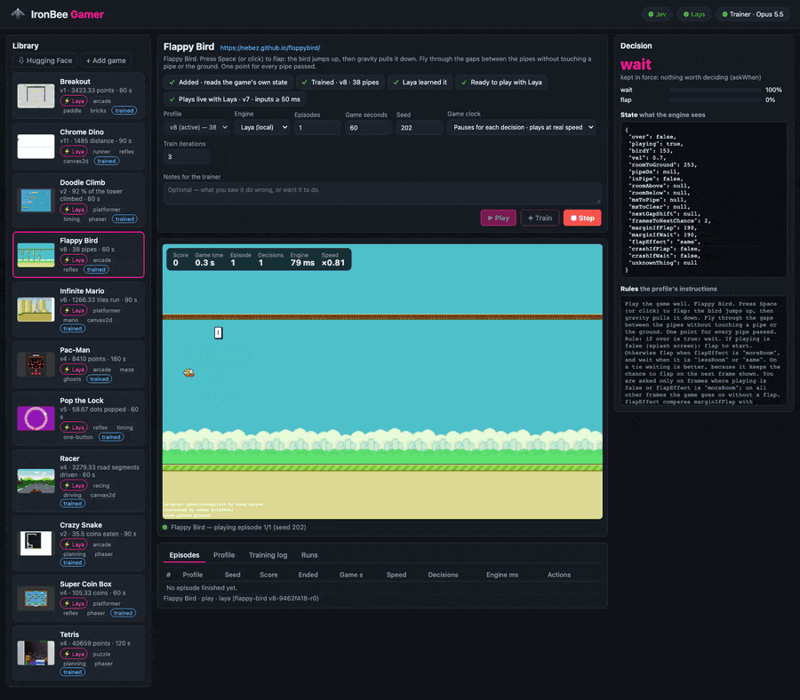

<p align="center">
  
</p>

<h1 align="center">IronBee Gamer</h1>

<p align="center">
  <strong>Plays browser games live with a fast decision engine. An LLM trains each game's profile from the games it plays.</strong>
</p>

---

IronBee Gamer opens a browser game, reads what the page draws into a small JSON state, and asks a
decision engine to pick every move. It works without any help from the game: it needs no API and
no hooks the game exposes.

You can watch the game being played in a local web UI. Each decision is shown beside it: the
state the engine saw, the action it chose and the probabilities.

[](docs/images/ui.png)

*Laya playing Flappy Bird in the UI, thirty seconds of it. On the right: each decision as it is made (`flap` or
`wait`), the state it was made on, and the rules the trainer wrote. Click it for a still at full size.*

```
page (canvas / engine)
  └─ perception adapter ── generic, per rendering tech (2D canvas draw recorder, Phaser / PixiJS / Cocos dump,
                           any canvas as a small colour grid), or a reader of the game's own state the
                           trainer wrote from the page's code
  └─ extract(raw, memory) ── per game, written by the trainer (an LLM), < 1 ms
  └─ state JSON (features, never the answer)
  └─ decision engine ── Jev (hosted) or Laya (local, fine-tuned per game)
  └─ keys held / the pointer held / a click
  └─ the game's clock runs one tick ← the game moves only between decisions
```

**The division of labor.** Each part has one job:

- **The trainer (an LLM through a coding-agent CLI: the Claude Code CLI or the Codex CLI, chosen with the UI's Trainer pill)** writes the logic: what the state
  computes, such as distances, how soon things happen and what is possible now. It also writes the rules that
  map those features to an action.
- **The decision engine** makes every live decision by applying those rules to the state.

A state that carries the answer (`advice: "JUMP"`) would make the engine a rubber stamp. Such
fields are stripped before the engine sees the state, and the trainer is told how many were
removed.

## Quick start

```bash
npm install
npm run build
npm link                             # once: puts the `ibgamer` command on your PATH
ibgamer laya setup                   # once: a Python environment for Laya, the local engine (needs python3)
npm run ui                           # the web UI at http://127.0.0.1:1986 (the same as `ibgamer ui`)
```

Without `npm link`, `npm start -- <command>` runs the same commands (`npm start -- play dino --seconds 30`).

In the UI, **⇩ Hugging Face** downloads the trained games — each with its profile versions and Laya's model
(about 700 MB a game). Then pick a game and press **Play**. The browser is headless by default, and the
live view shows it. Use `--headed` to see the real window. Until the game's first frame (a Laya
server to start, the browser, the page to load: several seconds) the screen says which step it is on
and for how long, and why, if the game does not start. When a game ends, the screen says how: **Time's up**
(its Game seconds are played — nothing hangs), **Game over**, or **Stopped**.

What each part needs:

- **Playing with Laya** (the default): the Python environment above, and the game's model — downloaded, or trained here.
- **Playing with Jev**: its key, `export TYPESAFE_API_KEY=…` (or in a `.env` in the working directory).
- **Training, and adding a game**: a coding-agent CLI, installed and logged in — the Claude Code CLI (`claude`) or the
  Codex CLI (`codex`). The **Trainer** pill at the top of the UI says which one and which model is used, and chooses it.

```bash
ibgamer library list                 # the games and their active profiles
ibgamer play dino --seconds 30       # plays in the terminal; --watch paces it to the game's own speed
ibgamer train flappy-bird           # checks how it plays, fixes what loses (else trains for a higher score), keeps it only if it plays better
ibgamer check pacman-ghosts          # plays a seed twice: the same frame for frame, or where it first differs
ibgamer play pop-the-lock --lag 45   # real time simulated on the paused clock: each decision lands 45 ms late, every run the same
ibgamer play dino --tick 48          # tried with 48 ms of game time between two decisions instead of the version's tick
```

## The library

The library lists every game the app knows how to reach, start and measure, together with the
profiles that play it.


*The eleven built-in games, each part way through a game Laya is playing (Pac-Man twice: its first level, and a later
one with the ghosts on the run).*

| Game | Played from | How it is read |
|---|---|---|
| Chrome Dino | [wayou/t-rex-runner](https://wayou.github.io/t-rex-runner/), a copy of Chrome's offline game | 2D canvas |
| Flappy Bird | [floppybird](https://nebez.github.io/floppybird/) by nebez (Apache-2.0) | the game's own state (HTML) |
| Pac-Man | [Pacman Canvas](https://pacman.platzh1rsch.ch/) by platzh1rsch (CC0) | pixels (a colour grid) |
| Doodle Climb | [Phaser examples](https://noowxela.github.io/phaser-examples/games/ready/doodle-jump/) | Phaser |
| Pop the Lock | [Phaser examples](https://noowxela.github.io/phaser-examples/games/ready/pop-the-lock/) | Phaser |
| Super Coin Box | [Phaser examples](https://noowxela.github.io/phaser-examples/games/ready/super-coin-box/) | Phaser |
| Tetris | [Phaser examples](https://noowxela.github.io/phaser-examples/games/ready/jtetris/) | Phaser (the game's own state) |
| Crazy Snake | [Phaser examples](https://noowxela.github.io/phaser-examples/games/ready/crazy-snake/) | Phaser (the game's own state) |
| Racer | [Javascript Racer](https://jakesgordon.com/games/racer/) by Jake Gordon (MIT) | the game's own state (a page reader) |
| Infinite Mario | [mariohtml5](https://kenspiretech.github.io/mariohtml5/main.html) by Robert Kleffner (Unlicense) | the game's own state (a page reader) |
| Breakout | [Javascript Breakout](https://jakesgordon.com/games/breakout) by Jake Gordon (MIT) | the game's own state (a page reader) |

All but Chrome Dino were added and trained by the app itself: the trainer set each one up from a sample of what the
page shows — or from the page's code, where it read that —, tuned it, and Laya learnt it. Their game definitions
are the only hand-written part, and Breakout's was made in the UI too. How each one plays, with every score, is in
[docs/measurements.md](docs/measurements.md).

The library has two roots that act as one:

- **Built-in** (`library/`, shipped with the package): the researched games, with their whole
  training history (every version, the tuner's analysis, the regression tests and the windows the
  tests replay).
- **Yours** (`~/.ibgamer/library`, or `IBGAMER_LIBRARY_DIR`): games you add, and every version
  training makes. A trained built-in game gets its new versions here, beside the shipped ones.
  You can always make an older version active again.

```
<game>/game.json            how to reach, start and measure it — never how to play it
<game>/profiles/v<N>.json   how to play it: extractor, rules, actions, timing, regression tests, results
<game>/windows/<id>.json    raw frames before a failure, replayed offline by the regression tests
<game>/samples/…            what training looked at (a raw sample, sprite crops, a screenshot)
<game>/decisions/*.jsonl    the engine's decisions while playing: distillation data for Laya
<game>/laya/<name>/         a Laya checkpoint fine-tuned on this game (v<profile>-<hash>-r<round>, ~650 MB)
```

To share a game, use `ibgamer library export <game> <dir>`, which writes every version into one
directory. Use `ibgamer library import <dir>` to add one. A game's extractor is JavaScript. It
runs in its own V8 context with no Node globals, no `eval`, a time limit, and only JSON crossing
the boundary. Still, add only games you trust.

### The Hugging Face library

Trained games are shared on Hugging Face, in one model repo with a folder a game
([ironbee-ai/ironbee-gamer-library](https://huggingface.co/ironbee-ai/ironbee-gamer-library) by default,
`IBGAMER_HF_REPO` to use another): each game's definition, its profile versions, its windows and samples, and
Laya's checkpoints of the versions it plays — not every round of every version, not the decision logs. A game
pulled from it plays at once, trained: Laya with no distillation, Jev with your own key.

- In the UI, **⇩ Hugging Face** above the library lists the shared games — how Laya and Jev play each, its size,
  and what your library has of it — and downloads one (**Download**, **Update**). A game trained in your library
  is replaced only after a second click; its decision logs stay.
- `ibgamer library hf` lists them; `ibgamer library pull <game…>` downloads (`--replace` over your own training).
  Every file is checked against its sha256 in the repo's `index.json`, all of a pull read at one commit.
- `ibgamer library push [game…]` shares games (every one by default) with the Hugging Face CLI
  (`pip install -U huggingface_hub`, then `hf auth login`): a game's folder in a commit that also removes what it
  no longer holds, then the index. A repo that is not there is made private (`--public` for a public one). Paths of
  your machine are taken out of what is shared; a file that still names your home folder stops the push.

The library is shared under the Elastic License 2.0, as IronBee Gamer (a push uploads `LICENSE` with the
README, which names it); Laya's checkpoints are fine-tuned from `jhu-clsp/mmBERT-base` (MIT). A private repo is
read with `HF_TOKEN`, else the token `hf auth login` keeps.

### Adding a game

In the UI, press **+ Add game**. A guided dialog takes a URL to a playable game in four steps:

1. **Page.** The page is opened and looked at. The verdict says what draws the game and how it
   will be read: a 2D canvas, Phaser, PixiJS or Cocos by a generic adapter. Any other canvas
   (WebGL from another engine, a bundled one) can be read by its pixels — a small colour grid
   each step, which works for anything but is less exact. Better, **let the trainer read the
   game's code**: it reads the page's scripts and writes one expression that returns the game's
   own state, which is checked on the page before it is offered. It takes a few minutes, and it
   works for any game whose state JavaScript can reach. While it is being written the dialog shows
   the step it is on and its time so far; you can go on to the other steps meanwhile, and **Add the
   game** waits for it (or **Stop reading** lets go of it).
2. **Start.** It starts by itself, on a key, or on a click you place on the page's screenshot.
3. **Game.** Its name, how to play it in the game's own words — needed: it is what the trainer and
   the engine are told the game is; the trainer proposes it when it read the game's code, for you
   to check — and the score: read by the trainer from what it perceives, or a page expression you
   know. A **Next** that stays grey says what it waits for.
4. **Engine.** Laya (local, fast; the trainer writes the rules as code and Laya learns them) or
   Jev (hosted; reads the rules as text). Training can start right away.

The game's page then shows a checklist (added → rules trained → Laya taught → playable) with the
next step's button. A running training or distillation shows its stages, a progress bar, the time
left and the results so far. The first training run samples the page, asks the trainer for an
extractor and actions, saves that first profile as v1 and then tunes it.

A game definition (`game.json`) holds only data:

```json
{
  "id": "dino",
  "name": "Chrome Dino",
  "url": "https://wayou.github.io/t-rex-runner/",
  "goal": "Chrome Dino (T-Rex runner). Press Space or ArrowUp to jump, ArrowDown to duck. …",
  "perception": { "adapter": "canvas2d" },
  "viewport": { "width": 800, "height": 400 },
  "start": [{ "press": ["Space"], "advanceMs": 700 }, { "waitMs": 1000 }, { "advanceMs": 800 }],
  "score": { "expression": "(() => { const r = Runner.instance_; return { over: r.crashed, score: … }; })()", "label": "distance" },
  "budgets": { "gameSeconds": 90, "episodes": 1, "trainSeconds": 90 },
  "trainSeeds": [101, 202, 303]
}
```

The `start` steps are what a player does to begin: keys, clicks, game time (`advanceMs`), and
real time with the clock frozen (`waitMs`); `holdFrom`, a page expression naming the key to hold,
walks a menu or a map whose way depends on the seed. Dino begins only when a CSS animation ends, and CSS
animations run in real time; waiting for it with the game's clock stopped makes every game start
at the same game time.

A game that stops between levels and waits for the player ("click to continue") reports
`waiting: true` from its score expression, and its `resume` steps (the same shape as `start`)
take it on to the next level.

How a game is offered is data too: `configs` lists the engine and clock pairs it is played with
(`{"engine": "laya", "live": true, "version": 11, "lagMs": 50}`: Laya, the clock never paused, on version 11, its
inputs landing no sooner than 50 ms after their frame) and `preferredConfig` the one it opens with. The UI offers
only those. A game that lists none — one you add — is offered what its versions earn: every engine with the clock
paused, and Laya live once a version trained for real time plays there nearly as well as paused. Nothing to write
by hand.

The score expression reads the game's own state and is used **for measuring only**. Neither the
engine nor the trainer ever sees it as a state field. A game without one can use
`"score": { "fromState": true }`, where the profile's own `state.score` / `state.over` is the
measure. That measure is self-reported, so a tuner could inflate it.

## How a game is played

- **A frozen clock.** Playwright's clock is installed before the page loads. After boot, time
  stops, and each step runs exactly `tickMs` of game time (32 ms at least: a decision of the local
  engine takes about that long, and a game watched at its own speed must not fall behind it). The
  engine's latency costs no game time, so a real-time game becomes turn-based.
- **One step per decision.** Each step is one round trip to the browser: the input, then the
  game time, then the raw input and the score. `decideOn: "change"` holds an action until the
  state changes (a maze game's turn window). `askWhen` skips the engine while nothing is happening,
  and the last decision stays in force.
- **Input.** A key chosen again stays held; releasing and re-pressing it would cut a jump short.
  A click action clicks the game's centre (or a point) once. A pointer action holds the mouse
  button down while it is in force, for games that charge while pressed and act on release.
- **Seeds.** Every episode is a fresh page load with `Math.random` seeded (and a Phaser game's
  own RNG, which it seeds from the time, sown from it), and the clock is frozen on an animation
  frame boundary. So the same seed plays the same game, frame for frame, and two profile versions
  (or a Laya student and its teacher) are compared on identical games.
- **Game clock** (the UI's setting, `--watch` / `--realtime` in the CLI):
  - *Pauses for each decision, plays at real speed* (the UI's default): a step is never faster
    than the game's own speed, and a slow decision is a pause.
  - *Pauses for each decision, as fast as possible*: training and measuring play this way.
  - *Never pauses*: the clock runs in real time as for a person, and the game does not wait for a
    decision.

  In real time the engine decides on a state the game has already left, and a game that allows no lateness — a
  jump that must come right after landing, a click that must land on the dot — is lost. What fixes it is a profile
  trained for real time: its extractor describes the world the action will meet (`info.lagMs`), and the player
  holds each input to land at that lag, so an engine whose time varies plays like one with a fixed delay. A game
  is offered live only once a version plays there nearly as well as with the clock paused. `ibgamer play <game>
  --lag 45` simulates real time on the paused clock, the same every run.
- **Plans, for an engine slower than the game.** A hosted engine that answers in hundreds of ms can be asked for
  the next few moments in one request (`train --no-check --realtime --latency 250-600 --plan 8x50`): the extractor
  predicts each moment, and the player lands each input at its moment while the next request is already out. It is
  playable, not good, so no game offers Jev live yet ([docs/design/realtime-plans.md](docs/design/realtime-plans.md)).

## Training

```
play the best version on fixed seeds (several games at once)
  → evidence: scores, the last decisions before each end, end screens,
    the raw frames before each failure (saved as windows), things perceived for the first time
  → the trainer writes a new version + regression tests that pin its fix down
  → it must pass every regression test offline (one repair round)
  → it plays the same seeds → kept only if its mean is higher
```

In the UI, **Train** makes the game play better with the engine and clock chosen above it — Laya or Jev, the clock
paused or running (Jev paused only); `ibgamer train <game> --engine laya` in the CLI. It is the one button to press,
whether the game plays badly or well:

1. **It checks.** The engine plays the game beside the version's rules as code, on the same seeds and the same
   clock, and the check says where the engine plays worse and whose loss it is: the version's (the engine and its
   rules both lose) or the engine's alone.
2. **It fixes what loses.** The version is trained where it loses. Laya is taught more where it alone does: it
   plays, the rules correct it, it learns from that. Jev's instructions are trained with Jev deciding. With nothing
   playing worse, the version is trained for a higher score.
3. **It checks again**, and keeps the change only if the game plays better; one that does not is undone.

With nothing to check yet — a new game, or Laya with no model of the version it plays — Train starts from there:
the trainer writes the rules (in words for Jev, as code for Laya), and Laya learns the version kept.

`ibgamer train <game> --check-only` only says what it would fix; `--no-check` trains without the checks, with the
trainer's own options (`--decider`, `--seeds`, `--realtime --simulated`, `--plan`, …). `ibgamer laya distill`
teaches Laya by hand.

**For real time.** A game that does not wait for the player is trained for it (the setup checklist's **Train for
real time**, the wizard's box, `ibgamer train <game> --realtime`): the rules decide late, as Laya answers live on a
quiet machine and on a busy one, and a version must play well across that range. It is kept only if it plays no
worse with the clock paused, so one version serves both clocks; one that plays better live but worse paused is
kept for the live clock only.

**Notes for the trainer** (beside Train and in the wizard; `train --note "…"` in the CLI) tell the trainer what you
saw the game do, or want it to do. A version is still kept only when it scores higher: notes the measure does not
reward are tried and turned away, and the log says so.

A version is kept only when it beats the best one on the same seeds, plays seeds it was never shown no worse, and
passes every regression test. Training stops after two attempts in a row that keep nothing, or once a version
reaches the game's top score (`score.max`). "Trained once, done" is wrong: a profile covers only the phases of a
game it has seen, so a game that changes later on — a night mode, a faster level — needs training on longer
games. The research behind this, with every pitfall, is in [research/KNOW-HOW.md](research/KNOW-HOW.md).

### The trainer

The trainer is an LLM run through a coding-agent CLI on its own login — no API key is read. One choice for
the whole app, not a game's: the **Trainer** pill at the top of the UI names the model in use and opens the
choice.

| CLI | Models | What it can read |
|---|---|---|
| Claude Code (`claude`), the default | Haiku, Sonnet, Opus (the default), Fable — each the latest of its family; the UI shows which (`Opus 5.5`), asked of the CLI itself | the training run's own folder only |
| Codex (`codex`) | the ones it lists on this machine; its newest Sol the default | any file of this user: its sandbox is read-only (no writes, no network) but not held to the run's folder |

Beside the model, the dialog sets the trainer's **effort** — how hard it thinks before it answers (Claude Code: low to
max; Codex: the levels it lists for the model). Leave it at the CLI's own unless trainings run out of time: one call
of the trainer is cut off after 30 minutes (`IBGAMER_TRAINER_TIMEOUT_MINUTES`) and is lost whole then. The trainer is
told its limit in every prompt, and a tuning that ran out of time tells the next attempt so; a lower effort answers
sooner.

Either way the CLI gets none of this app's keys, writes nothing and saves no session. The difference in what
they can read matters because a prompt carries text the game's page drew: with Codex, a page could talk the
trainer into repeating a file of yours in the rules it writes. The choice is kept in `~/.ibgamer/settings.json`,
so `ibgamer train` uses it too; `IBGAMER_TRAINER_PROVIDER` / `IBGAMER_TRAINER_MODEL` win over it.

## Decision engines: Jev, Laya and the rules as code

| | Jev (TypeSafe, hosted) | Laya (open, local) | Rules (code) |
|---|---|---|---|
| A decision | a few hundred ms, most of it the round trip | tens of ms on a local GPU | instant |
| Rules | reads them in the instructions every decision | learns them: fine-tuned per game and profile version | are the profile's `teach(state)`, written by the trainer |
| Setup | `TYPESAFE_API_KEY` | `ibgamer laya setup`; a game's model is downloaded, or learnt by training | none: a version trained for Laya carries them |

The rules as code play as well as they are written, from the moment training writes them: they are what Laya
learns, and what a check holds an engine against. The UI does not offer them as an engine (`ibgamer play <game>
--engine rules` still plays them). They know only what they were written for; an engine that reads the rules as
text can reason about what the code did not foresee.

Laya is a small model: it cannot read long rules, and without training it plays a game near chance. So a game's
Laya is **distilled** — the rules are learnt into its weights from labelled states:

1. **The teacher.** The trainer writes the profile's rules twice: as the instructions (for Jev and people) and as
   `teach(state)`, the same rules as code. The teacher is checked before it teaches: it must agree with the
   engine's logged decisions, and score like the profile when it plays by itself.
2. **Labelled states.** The teacher plays many games in a few minutes, a random move now and then so the data
   leaves its own path. The state is still features only; the teacher's answer is the training *target*.
3. **Fine-tuning.** `laya/finetune.py` fine-tunes a copy of Laya on those rows.
4. **DAgger.** Laya plays, the teacher labels the states Laya visited, and training continues from the last
   checkpoint: it learns the states its own mistakes lead to, which the teacher's games never reach.
5. **Serving.** `laya/serve.py` serves each game's checkpoint over the same `/v1/systemone` protocol. The UI
   starts it when Laya is chosen for a game.

```bash
ibgamer laya setup                       # a Python environment with Laya (~/.ibgamer/laya-venv)
ibgamer laya distill dino                # teacher → data → fine-tune → DAgger → Laya plays the seeds
ibgamer laya distill dino --resume --rounds 2  # more DAgger rounds from the checkpoint there
ibgamer play dino --engine laya --watch  # or in the UI: Engine "Laya (local)"
```

A checkpoint belongs to the profile version whose states it learnt. A new extractor means
distilling again. A new teacher means relabelling, which is instant, and fine-tuning again.
One checkpoint is kept per profile version: a new one replaces it only if it plays the profile's
seeds better. A game can keep checkpoints of several versions — one for the paused clock, another
from a version trained for real time (`laya distill <game> --profile-version <n>`; a config pins
the version) — and Laya plays the version's own, the active version's when none is named.

## Configuration

| Variable | Default | Meaning |
|---|---|---|
| `TYPESAFE_API_KEY` / `JEV_API_KEY` | – | Jev's key |
| `IBGAMER_ENGINE` | `jev` | `jev` or `laya` |
| `IBGAMER_LAYA_PYTHON` / `IBGAMER_LAYA_PORT` | `~/.ibgamer/laya-venv` (else `python3`) / `8601` | the Python with Laya, and the port of the server the app starts |
| `LAYA_URL` / `LAYA_MODEL` | `http://127.0.0.1:8000` / – | a Laya server you run yourself, and the checkpoint name to ask |
| `IBGAMER_UI_PORT` / `IBGAMER_UI_HOST` | `1986` / `127.0.0.1` | the web UI |
| `IBGAMER_HEADLESS` | `true` | `false` shows the browser window |
| `IBGAMER_HOME` | `~/.ibgamer` | the user library (`library/`) and runs (`runs/`) |
| `IBGAMER_DAEMON_URL` | – | an IronBee DevTools daemon to use, started with this package's `TOOL_PLUGINS` |
| `IRONBEE_DEVTOOLS_DAEMON_SCRIPT` | the installed package | the DevTools daemon to start |
| `IBGAMER_TRAINER_PROVIDER` / `IBGAMER_TRAINER_MODEL` / `IBGAMER_TRAINER_EFFORT` | `claude-code` / its default (`opus`) / the CLI's own | the trainer's CLI (`claude-code` or `codex`), its model and its effort (`low`, `medium`, `high`, …); set, they win over the one chosen in the UI (the Trainer pill, kept in `~/.ibgamer/settings.json`) |
| `CLAUDE_CODE_CLI` / `CODEX_CLI` | `claude` / `codex` | the trainer CLIs' executables |
| `IBGAMER_TRAINER_TIMEOUT_MINUTES` | `30` | how long one call of the trainer may take: one cut off is lost whole (the trainer is told its limit) |
| `IBGAMER_HF_REPO` / `IBGAMER_HF_REVISION` | `ironbee-ai/ironbee-gamer-library` / `main` | the Hugging Face library, and the branch or commit pulled |
| `HF_TOKEN` / `HF_ENDPOINT` / `IBGAMER_HF_CLI` | the token `hf auth login` keeps / `https://huggingface.co` / `hf` | reading a private repo; the Hub; the CLI a push uploads with |

## Under the hood

The browser belongs to an [IronBee DevTools](https://www.npmjs.com/package/@ironbee-ai/devtools)
daemon, the same one IronBee Express uses. The game tools run inside it as a **tool plugin**
(`dist/devtools-plugin/game-tools.mjs`, loaded with `TOOL_PLUGINS`):

- `game_open` installs the perception adapter, the seed and the clock, then loads and boots the
  page.
- `game_step` applies the input, runs game time, and reads the raw input and the score.
- `game_probe` reports which rendering tech a page uses.
- `game_sprite-crops` returns what a recorded sprite looks like.

DevTools' screencast feeds the live view and the videos.

## License

[Elastic License 2.0](LICENSE)
